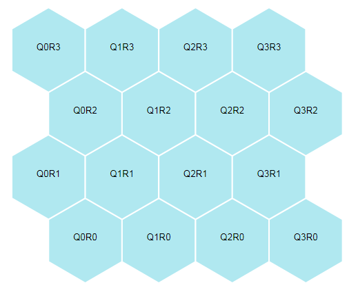
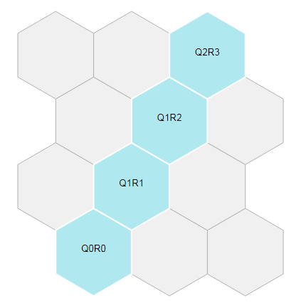

# d3-hexjson

This D3 plugin makes it easy to generate hexmaps from data that uses the Open Data Institute's [HexJSON format](https://odileeds.org/projects/hexmaps/hexjson.html). The plugin provides a single function that takes a HexJSON object and adds the properties needed to render it as a hexmap of a given size. The `renderHexJSON` function calculates the hex size necessary to render the hexmap within an svg of the specified dimensions, and generates the position and the points for each hex. This data is returned as an array of hexes that you can render directly with D3 as polygons, by using the *x* and *y* coordinates to position each hex, and the *points* property as the *points* attribute of its polygon. Hex coordinates are rendered according to the [coordinate system](http://www.redblobgames.com/grids/hexagons/#coordinates) specified by the *layout* property of the HexJSON provided.

## Installing

If you use NPM, `npm install d3-hexjson`. Otherwise, download the [latest release](https://github.com/olihawkins/d3-hexjson/releases/latest) and use **d3-hexjson.min.js**, which can be found in the build directory. The module is designed to be used in conjunction with the core [D3 library](https://github.com/d3/d3) (see the [example](#example) below).

## API Reference

<a name="renderHexJSON" href="#renderHexJSON">#</a> d3.<b>renderHexJSON</b>(<i>hexjson</i>, <i>width</i>, <i>height</i>)

Returns an array of hexes from a HexJSON object, adding to each hex the properties needed to render them as a hexmap with D3. The function calculates the appropriate size to render the hexes within an svg of the given width and height. The central pixel coordinates of each hex are stored in *x* and *y* properties, while the *vertices* property holds an array of coordinate pairs, which specify the position of each vertex relative to x and y. The *points* property contains the vertex coordinates as a string that can be inserted directly into the *points* attribute of a polygon. The key used to reference each hex within the HexJSON object is stored within each hex in the *key* property. As these properties are added to the hexes stored in the source HexJSON, the hexes and their properties can be accessed either through the returned array or through the original HexJSON object (if you need to merge additional data based on the key, for example).

The full list of properties that the function adds to each hex is as follows:

* **key** - The key against which the hex is stored in the source HexJSON
* **qc** - The absolute column number of the hex, measured left to right from zero 
* **rc** - The absolute row number of the hex, measured top to bottom from zero 
* **x** - The pixel coordinate of the centre of the hex within the svg on the x-axis
* **y** - The pixel coordinate of the centre of the hex within the svg on the y-axis
* **vertices** - The pixel coordinates of the vertices **relative to x and y**
* **points** - The vertex positions represented as a string for use in an svg polygon

Note that while the absolute row numbers of each hex are represented internally in the *rc* property from top to bottom, the *r* property of the HexJSON data represents row numbers from **bottom to top**. This follows the row numbering convention used in the example HexJSON implementation provided by the ODI in their hexmap of [UK Parliamentary constituencies](https://odileeds.org/projects/hexmaps/constituencies.html).

<a name="getGridForHexJSON" href="#getGridForHexJSON">#</a> d3.<b>getGridForHexJSON</b>(<i>hexjson</i>)

Returns a new hexjson object representing the complete grid for a hexjson dataset. The returned grid has the same *layout* as the hexjson provided, and the same number of columns and rows needed to represent the data. The main purpose of this function is to produce the hex data needed to display a background grid for the given dataset (see the [example with background grid](#example-with-background-grid) below), but it also provides a convenient way to generate hex grids for other uses.

<a name="getBoundarySegmentsForHexJSON" href="#getBoundarySegmentsForHexJSON">#</a> d3.<b>getBoundarySegmentsForHexJSON</b>(<i>hexjson</i>, <i>width</i>, <i>height</i>, <i>field</i>))

Provides an array of line segments corresponding to the single edges between hexes in the provided *hexjson* which do not have the same value in their *field* property. The segments returned are in the form `{x1, x2, y1, y2}` as used to make simple SVG line segments. Unlike for **renderHexJSON**, these coordinates are absolute and do not need to be transformed.

No line segments are added for external borders (where a hex has no adjacent hex). Line segments should be consistently directed with respect to the comparison of the *field* values of the two hexes.

These line segments are not ordered so as to create contiguous polylines.

This function has all the side-effects of adding properties to each hex as **renderHexJSON**.

<a name="getBoundaryDotsForHexJSON" href="#getBoundaryDotsForHexJSON">#</a> d3.<b>getBoundaryDotsForHexJSON</b>(<i>hexjson</i>, <i>width</i>, <i>height</i>, <i>field</i>))

Provides an array of points along the edges between hexes in the provided *hexjson* which do not have the same value in their *field* property. The points returned are in the form `{x, y}` and may be used (for example) as the centre of SVG circles. Unlike for **renderHexJSON**, these coordinates are absolute and do not need to be transformed.

Each edge has five points - one at each end, and three evenly distributed in between. Where two or more edges meet at a vertex, each edge will contribute its own point in the array returned by this function. The points for each edge are included in sequence, but the edges' points are not ordered so as to create contiguous polylines.

This function has all the side-effects of adding properties to each hex as **renderHexJSON**.

## Example

The following example shows the most common usage. See the code in action in this [block](https://bl.ocks.org/henryjameslau/5daca6e4667c41ae85959da614a37787) by [Henry Lau](https://github.com/henryjameslau).

Given this HexJSON stored in the file *example.hexjson*:

```javascript
{
	"layout":"odd-r",
	"hexes":{
		"Q0R0":{"q":0,"r":0},
		"Q1R0":{"q":1,"r":0},
		"Q2R0":{"q":2,"r":0},
		"Q3R0":{"q":3,"r":0},
		"Q0R1":{"q":0,"r":1},
		"Q1R1":{"q":1,"r":1},
		"Q2R1":{"q":2,"r":1},
		"Q3R1":{"q":3,"r":1},
		"Q0R2":{"q":0,"r":2},
		"Q1R2":{"q":1,"r":2},
		"Q2R2":{"q":2,"r":2},
		"Q3R2":{"q":3,"r":2},
		"Q0R3":{"q":0,"r":3},
		"Q1R3":{"q":1,"r":3},
		"Q2R3":{"q":2,"r":3},
		"Q3R3":{"q":3,"r":3}
	}
}
```

A hexmap of the data can be rendered in the following way:

```html
<html>
<head>
<style>
#vis {
	margin: 0;
	padding: 0;
	text-align: center;
	font-family: sans-serif;
	font-size: 10pt;
}
</style>
</head>
<body>
<div id="vis"></div>
<script src="d3.min.js"></script>
<script src="d3-hexjson.min.js"></script>
<script>

d3.json("example.hexjson", function(error, hexjson) {

	// Set the size and margins of the svg
	var margin = {top: 10, right: 10, bottom: 10, left: 10},
		width = 500 - margin.left - margin.right,
		height = 420 - margin.top - margin.bottom;

	// Create the svg element
	var svg = d3
		.select("#vis")
		.append("svg")
		.attr("width", width + margin.left + margin.right)
		.attr("height", height + margin.top + margin.bottom)
		.append("g")
		.attr("transform", "translate(" + margin.left + "," + margin.top + ")");

	// Render the hexes
	var hexes = d3.renderHexJSON(hexjson, width, height);

	// Bind the hexes to g elements of the svg and position them
	var hexmap = svg
		.selectAll("g")
		.data(hexes)
		.enter()
		.append("g")
		.attr("transform", function(hex) {
			return "translate(" + hex.x + "," + hex.y + ")";
		});

	// Draw the polygons around each hex's centre
	hexmap
		.append("polygon")
		.attr("points", function(hex) {return hex.points;})
		.attr("stroke", "white")
		.attr("stroke-width", "2")
		.attr("fill", "#b0e8f0");

	// Add the hex codes as labels
	hexmap
		.append("text")
		.append("tspan")
		.attr("text-anchor", "middle")
		.text(function(hex) {return hex.key;});
});

</script>
</body>
</html>
```


The example will look like this:




## Example With Background Grid

The following example shows how to render hexjson data as a hexmap with a background grid. Use the `getGridForHexJSON` function to generate a hexjson object representing the background grid for the source data, then render the background hexes **before** rendering the data hexes on top. [See it in action in this block](https://bl.ocks.org/henryjameslau/4057a986db97e475b1a154c9fcf1fa7d).

Given this HexJSON stored in the file *example-grid.hexjson*:

```javascript
{
	"layout":"odd-r",
	"hexes": {
		"Q0R0":{"q":0,"r":0},
		"Q1R1":{"q":1,"r":1},
		"Q1R2":{"q":1,"r":2},
		"Q2R3":{"q":2,"r":3}
	}
}
```

A hexmap of the data with a background grid can be rendered in the following way:

```html
<html>
<head>
<style>
#vis {
	margin: 0;
	padding: 0;
	text-align: center;
	font-family: sans-serif;
	font-size: 10pt;
}
</style>
</head>
<body>
<div id="vis"></div>
<script src="d3.min.js"></script>
<script src="d3-hexjson.min.js"></script>
<script>

d3.json("example-grid.hexjson", function(error, hexjson) {

	// Set the size and margins of the svg
	var margin = {top: 10, right: 10, bottom: 10, left: 10},
		width = 500 - margin.left - margin.right,
		height = 420 - margin.top - margin.bottom;

	// Create the svg element
	var svg = d3
		.select("#vis")
		.append("svg")
		.attr("width", width + margin.left + margin.right)
		.attr("height", height + margin.top + margin.bottom)
		.append("g")
		.attr("transform", "translate(" + margin.left + "," + margin.top + ")");

	// Create the grid hexes and render them
	var grid = d3.getGridForHexJSON(hexjson);
	var gridHexes = d3.renderHexJSON(grid, width, height);

	// Render the data hexes
	var hexes = d3.renderHexJSON(hexjson, width, height);

	// Draw the background grid BEFORE the data

	// Bind the grid hexes to g.grid elements of the svg and position them
	var hexgrid = svg
		.selectAll("g.grid")
		.data(gridHexes)
		.enter()
		.append("g")
		.attr("transform", function(hex) {
			return "translate(" + hex.x + "," + hex.y + ")";
		});

	// Draw the polygons around each grid hex's centre
	hexgrid
		.append("polygon")
		.attr("points", function(hex) {return hex.points;})
		.attr("stroke", "#b0b0b0")
		.attr("stroke-width", "1")
		.attr("fill", "#f0f0f0");

	// Bind the data hexes to g.data elements of the svg and position them
	var hexmap = svg
		.selectAll("g.data")
		.data(hexes)
		.enter()
		.append("g")
		.attr("transform", function(hex) {
			return "translate(" + hex.x + "," + hex.y + ")";
		});

	// Draw the polygons around each data hex's centre
	hexmap
		.append("polygon")
		.attr("points", function(hex) {return hex.points;})
		.attr("stroke", "white")
		.attr("stroke-width", "2")
		.attr("fill", "#b0e8f0");

	// Add the codes for the data hexes as labels
	hexmap
		.append("text")
		.append("tspan")
		.attr("text-anchor", "middle")
		.text(function(hex) {return hex.key;});
});

</script>
</body>
</html>
```

The example will look like this:




These examples can also be found in the *examples* directory.
